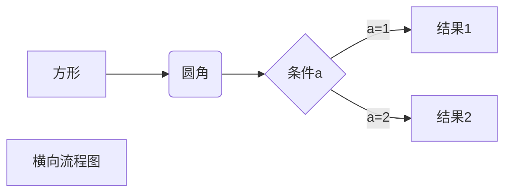
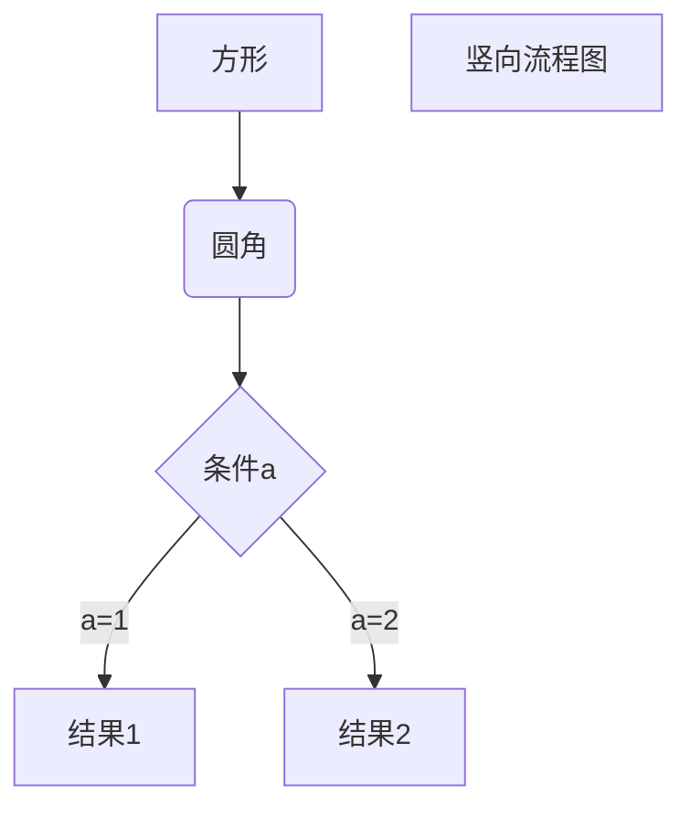

<!-- more -->

Typora流程图
===========

示例：
----
**横向流程图**

```mermaid
graph LR
A[方形] -->B(圆角)
    B --> C{条件a}
    C -->|a=1| D[结果1]
    C -->|a=2| E[结果2]
    F[横向流程图]
```

**竖向流程图**

```mermaid
graph TD
A[方形] --> B(圆角)
    B --> C{条件a}
    C --> |a=1| D[结果1]
    C --> |a=2| E[结果2]
    F[竖向流程图]
```

暂时只用到这两种 其他类型的用到时候再更新吧！
