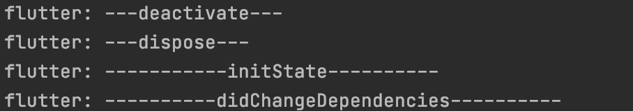

<!-- more -->
flutter的LessWidget只有createElement与build 两个声明周期，无需深入理解。

stattefulwidget生命周期方法按照时期不通分为三组：  
1.初始化时期

	cretateState、initState

2.更新周期

	didChangeDependencies、build、didUpdateWidget

3.销毁周期

	deactivate、dispose

initState()

构建Statefulwidget时会立即调用，并且这个方法必须被覆盖(必须重写)

didChangeDependencies()  
当依赖的state对象改变时会被调用

在第一次构建widget时在initstate()之后会立即调用

如果statefulwidget以来已inheritedwidget改变时会再次调用

inheritedwidget可以搞笑将数据在widget树中向下传递

build()  
必须实现的方法，实现你想要呈现的页面内容

会在didChangeDependencies()之后立即调用

当setState调用后也会再次调用该方法

didUpdateWidget()  
不常用，当父组件需要重新绘制时才会调用

该方法会携带一个oldWidget参数，可以与widget进行对比以便执行额外的逻辑

deactivate()  
不常用，当组件被溢出时调用在dispose之前调用

dispose()  
常用，组件被销毁时

通常在该方法中执行一些资源的释放工作，比如监听器卸载，channel的销毁等

可用于取消注册销毁保存的内容
