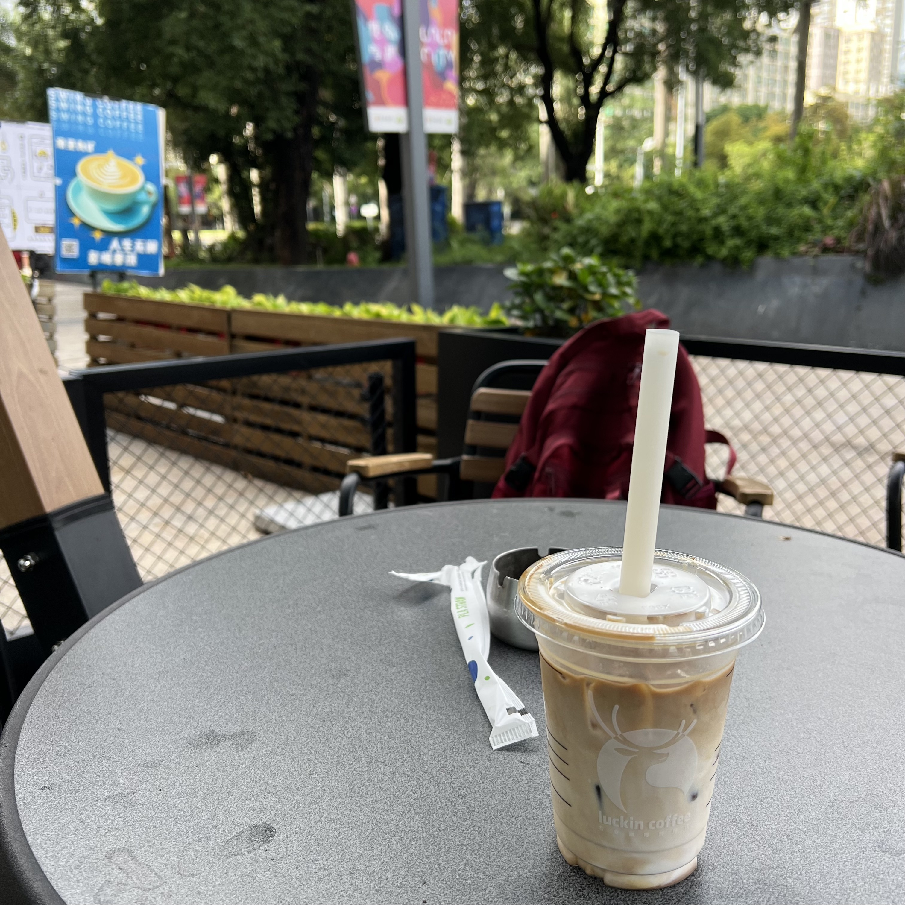

<!-- more -->
5月28日 天气多云  
今天早上6点28分就醒了  
不知道是被我的猫弄醒了亦或是自然醒的一天  
大概也就只睡了5个多小时  我有点惊喜  
因为我已经不知道多久没有这么早醒了
大概是7点半左右出门 之后去吃了个早餐  
吃完了之后想着到附近的书店看看书再开始一天的工作吧  
没想到的或许是因为已经很久没有这么早醒了 
我连书店的营业时间(10-22)都不知道  
一开始还有点沮丧吧 就在附近稍坐了一会 吹着风  
身前身后有着来来往往的退休中老年人  
让我有一种融入到这个群体的错觉  
坐了大概十几分钟之后我起身准备离开  
出来了一趟总不能什么也没有收获吧  
我就到附近的瑞幸咖啡点了一杯很久没喝过了的生椰拿铁
味道还是那个味道 只不过是没有了上班的感觉罢了
闲坐喝咖啡 看了会杂志 吹吹风 原来清晨可以这么美好

