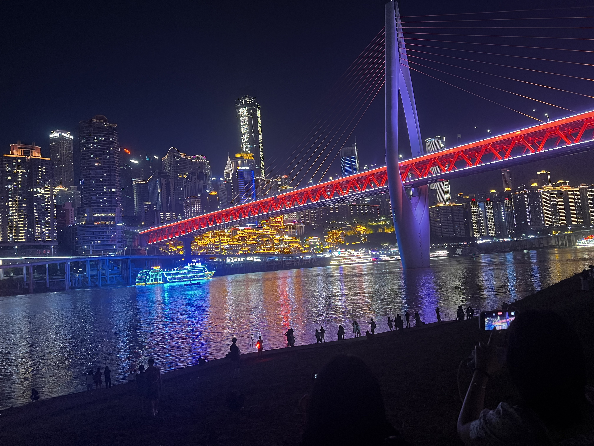

<!-- more -->

Day1: 漾 · LiveHouse
------------

一个偶尔会很嘈杂的地方，一个很多俊男靓女的地方，一个很多网红推荐的听歌喝酒玩游戏的地方，这里也是我们相见的地方。  
要说实话的话，这里确实没什么好玩的，除了其中那么一两个驻唱的唱功还可以，氛围一般。

Slowly
--------
当天我们预约的位置需要在九点半之前到，否则位置就要被取消，所以我们赶在九点钟就到了现场，一开始等人齐还没有喝酒，正式开始喝的话应该是要从十点钟算起，喝了一个小时，还没看到你人来，我开始担心了：她该不会放我们鸽子了吧？所幸大概是十一点半左右，你终于来了，我着急的心终于放了下来，虽然你的长相很普通，但是你的笑容很甜，当时的我还没有这么想，现在想起来也只能回味了。

Intro
------------
或许是因为只有我坐在你旁边，而且酒吧的音响很大声，所以你只能找我说话，你向我把周围所有人都稍微打听了一遍，然后向每个人都敬了一杯酒。我感到意外，这就是重庆人打招呼的方式吗。  
你问我多大，我说我00的，你说你也是，但我一眼就看出来了你不是，后面你也坦诚了其实你是99的。  
在玩游戏的时候通过交流中我也简单的了解到虽然你的外表娇小，但是你性格的另一面是个内心强大的人，有着面对一切的勇气。

Day1:End
--------
到了晚上大概是一点多，大家都喝的差不多了，也就各自打车回家了。

Day2:Begin
----------
回到酒店后，我知道第二天我们还会出来见面，或许这就是心灵感应吧，第二天你真的出现了。跟我们一起吃了晚饭后逛了一会决定去重庆长江大桥的桥底下，也就是洪崖洞的对岸拍一些照片。在等待她们拍照的时候重庆的特色一个是在景点内一些小贩会过来喊一圈她们想要像你出售的特色小吃。然后你突然问我你想吃冰棍吗，我说不吃。我就猜到其实你想吃随即就问道：你想吃吗?你说出了内心的想法，其实你不想一个人吃，那我作为一个男子汉当然是要满足身边女性的所有诉求的，好在小贩子还没有走远，追过去还来得及。我立即跑过去要了两根老冰棍，真的很冰，随即我想到的是你穿的这么少，会不会冷，所幸我带了一件薄外套，冷的话你也可以随时找我借。在桥底往上看是重庆的长江大桥，往对岸看就是著名的风貌街道的洪崖洞，洪崖洞背后的就是一栋一栋的高楼，去过的应该都不由得感叹一声重庆的夜景真的很美，不过重要的不是夜景有多美，而是一起看夜景的人是谁吧。

Night
----------
在桥底上来之后打了两辆车到了一条路边有几家摆摊的地方，本意是想要到一家特色烧烤的连锁店吃串串的，但是好像大家都不是很想吃串串，就点了一人一碗在重庆吃的最多的东西”冰汤圆”。然后找了一家看起来应该很好吃的烧烤档坐下喝酒吃烧烤。也是在这间烧烤档你给我留下了最深的影像，不知道是不是因为坐在你对面的是我，所以你总是看着我，看着我时也总是带着你那很愉悦的看起来很甜美的微笑，你的笑容大概就是我这次旅行的最大收获了，谢谢你，陈小姐。酒后当然也就各自散去了，虽然第二天还要赶早上八点的飞机，但也还是喝的差点就不省人事了。

Traval:END
----------
因为要赶早上八点的飞机，所以在凌晨五点半就要起床洗漱收拾东西，起床后我感到很空虚，心里好像少了什么东西，像是失恋了一样，每当重要的人要离开的时候这种感觉就会涌上心头，所幸在坐出租车到机场的路上正是太阳升起的时候，稍微治愈了我。  
下午一点回到了住所，感情愈发强烈，陈小姐在不知不觉中就成为了我心里的那个重要的人，但是我们终究也只能是擦肩而过的成为彼此的路人了，我相信这个世界上是存在心灵感应的，当我内心中的感情涌上心头的时候，你那边应该也是吧。从重庆回来之后我发现时间过得很慢，慢到我能自我意识到我失去了你，慢到我没法专注于眼前的工作，慢到每时每刻我都会想起你那甜美的笑容，慢到我想马上坐上飞机回到重庆去见你。这篇文章也是趁着感情还没有完全消失之前，虽然没法把她永远留下来，但我可以将这美好的景色留下来，每当看到的时候都能想起她。  

`热情相拥的相识过后竟是落寞的悲欢离合，谁又会只满足于当下的快乐呢？`

