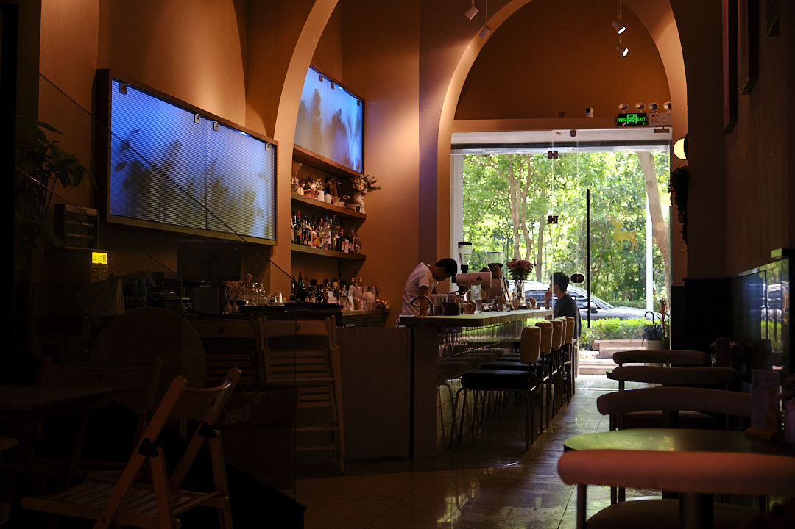
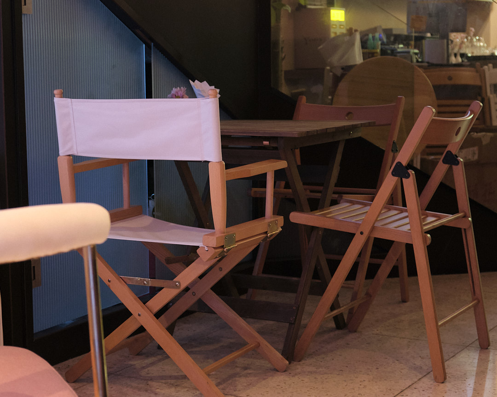
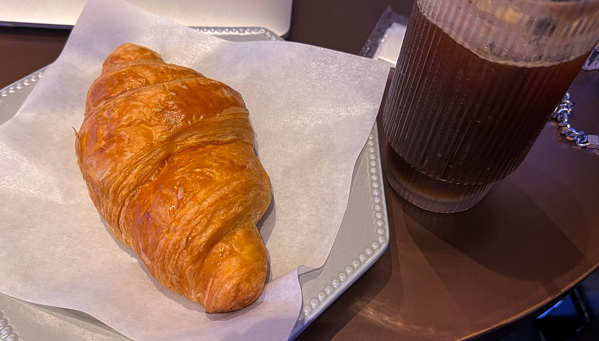

<!-- more -->
### 序言
转眼间已经快要六月了  
正是蝉鸣鸟叫的气节  
天气格外的闷热  
记忆中的少时也是这个气节的记忆尤多  

### 早上不好
上午的早高峰地铁真的令人崩溃  
周围都是急忙赶着要去上班的人  
每个人身上都是黏黏的感觉  
深圳的地铁站台很多也都是在高架上半封闭式的  
为这个湿热的天气增加了一分热度  

### 饮杯Cofee
外面太热了 找个地方避避暑吧  
来到了一家无人问津的咖啡馆  
体验到了非常贴切的服务  
这跟之前的类似gaga、maan..都完全不同  
也可能是店里没什么客人的缘故吧  

因为早上着急出门没吃早餐 现在时间也已经是中午的饭店了  
附近也找不到其他吃饭的地方  
一杯荔枝气泡美式和一份牛角包就成了我的午餐  

### TODO
虽然今天科目一考试没过  
但出来了一趟总不能什么都没有收获吧！  
今天晚上准备到深圳湾公园大桥附近拍一拍日落  
希望能够出一些好看的照片  
